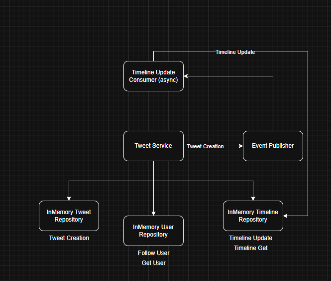
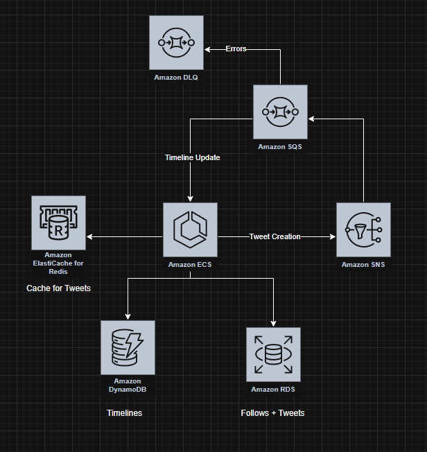

# Architecture Decisions

## High-Level Architecture Overview

### In-Memory Data Storage and Concurrency Control
The application is built using in-memory data stores and employs mutexes to prevent race conditions among concurrent goroutines.

### Asynchronous Domain Event System
To handle high read loads, I implemented an asynchronous, in-memory event system with a dedicated consumer. When a tweet is created, a domain event is triggered to pre-populate each user's timeline. This proactive strategy avoids querying all tweets from every followed user on-demand—a process that would otherwise impose an unsustainable read load.

### Configurable Timeline Update Window
I have set a configurable maximum delay (default: 5 seconds) for updating the timelines of followers after a tweet is posted. This design ensures timely timeline updates without blocking the tweet creation process.

### NOTE:
For this challenge solution, I did not enforce a limit on the number of tweets per timeline or implement pagination. Although these features would be essential in a production environment to maintain performance and usability, I think they were overkill for the scope of this solution.

## High-Level Production Architecture

For a production-ready system, My idea of the architecture is:

### Relational SQL for Follows:
Use a relational SQL database to manage user follow relationships. This ensures data integrity, as each follow relationship is maintained as a separate row, and new records can be added without overloading the system.

### NoSQL for Timelines:
Given the high read load on timelines, a NoSQL database such as DynamoDB or Cassandra is ideal. These systems allow storing each tweet as a document within a timeline and support pagination, making it easier to serve large volumes of data efficiently.

### Event Publishing with a Message Broker:
For domain events, I think we can implement a messaging system using brokers like SNS + SQS or Kafka. This setup allows you to send messages when a tweet is created and update users timelines asynchronously. It also leverages built-in retry mechanisms and dead-letter queues (DLQ) to improve resilience in case of update failures.

### Handling High-Load Users:
I think one useful idea would be that to users with an extremely high number of followers (millions) where preupdating timelines might impose a significant load maybe it can adopt a hybrid approach. In these cases, the timeline might not be updated asynchronously. Instead, it can be fetched on-demand from a cache (Redis) that stores tweets for these high-demand users. This strategy could help to avoid bottlenecks and ensures scalability.

## Design Pattern

The application follows a Clean Architecture pattern, which separates the business layer, data model, and use cases. This separation not only prevents tight coupling but also makes it easier to understand the system's functionality by simply reading the code. As a result, testing becomes more straightforward, and the logical organization of the application is clearer.

The architecture is divided into the following layers:

* Domain Layer:
  This layer contains the core entities (e.g User, Tweet) along with pure business logic. Domain-Driven Design (DDD) principles are applied here to encapsulate behaviors—for example, the User entity includes methods for following another user, complete with domain validations.
* Use Cases Layer:
  This layer implements the system's use cases (e.g Publish Tweet, Get Timeline). It orchestrates interactions between domain entities and coordinates operations, acting as a bridge between the domain and the external interfaces.
* Infrastructure Layer:
  This layer provides concrete implementations for the services defined in the application layer. It includes data repositories (for database access), cache clients, external system integrations, and more.
* cmd -> This is where the application's main entry point is located and where dependency injection is configured.

Since the application is written in Go, I tried to take full advantage of Go's implicit interface implementation. Interfaces are declared where they are used rather than where they are implemented. This design choice minimizes coupling, and the dependency injection container ensures that all interface contracts are met.
